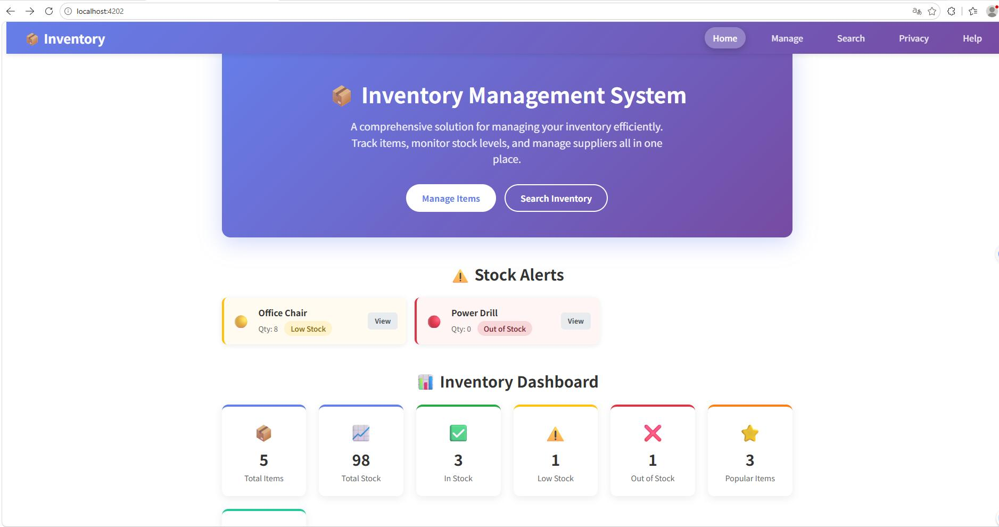
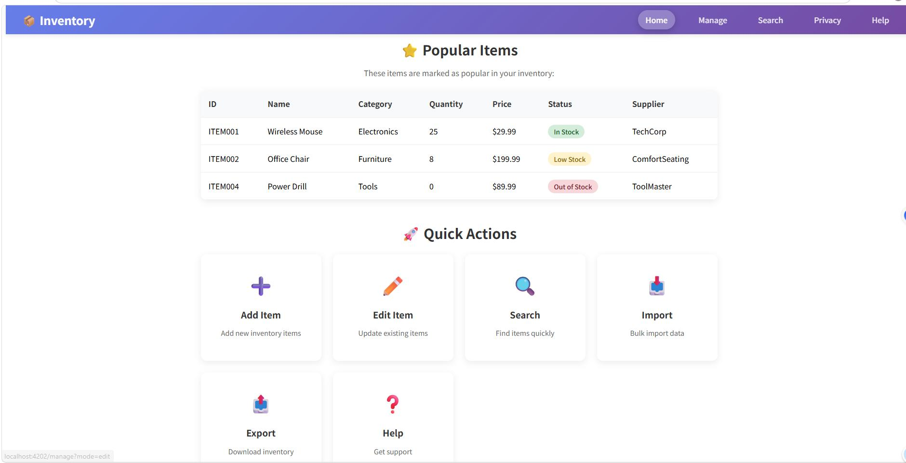
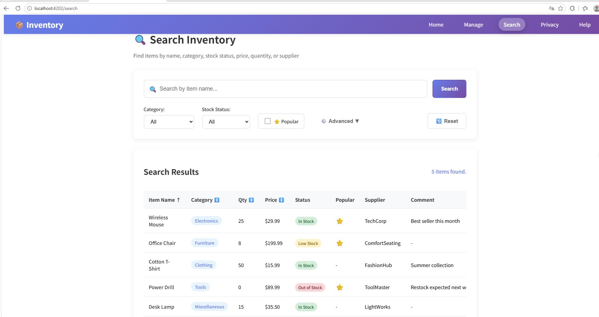
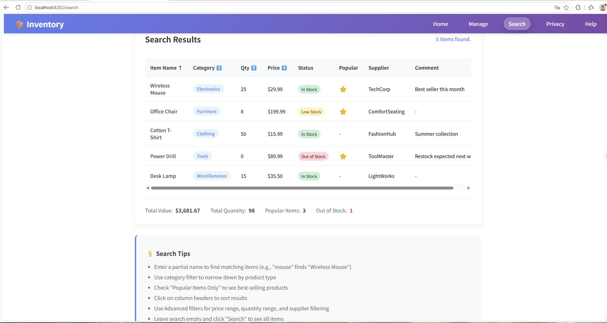
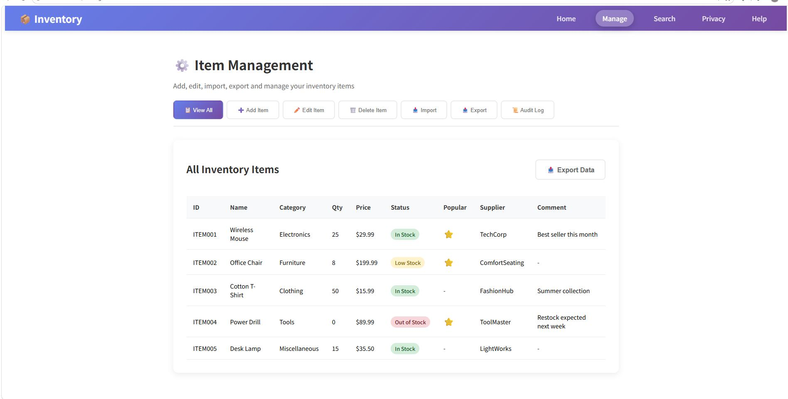
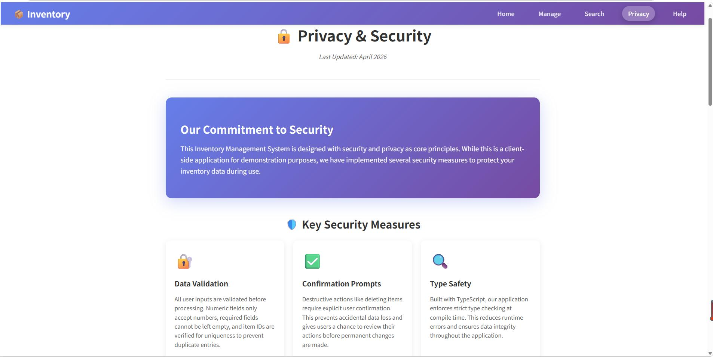
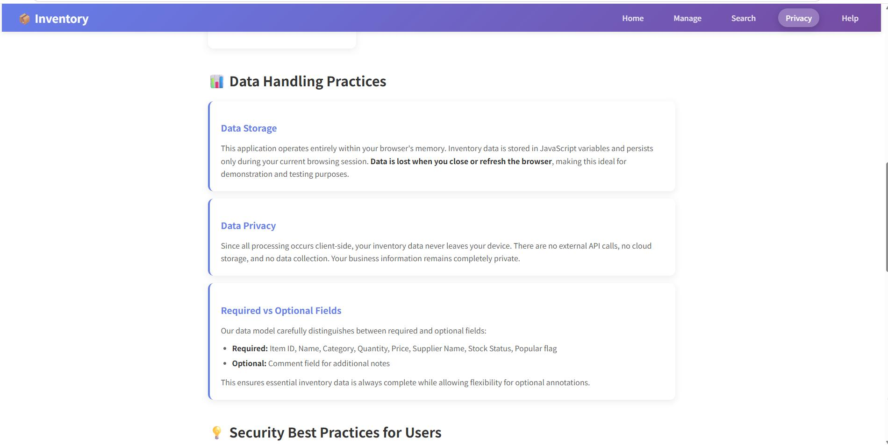
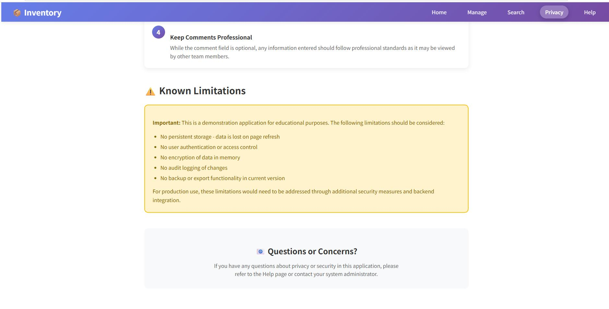
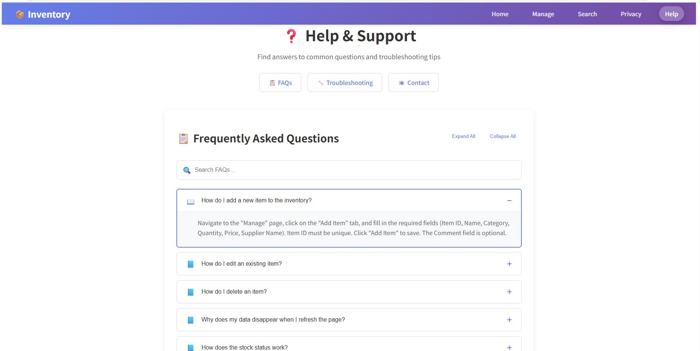
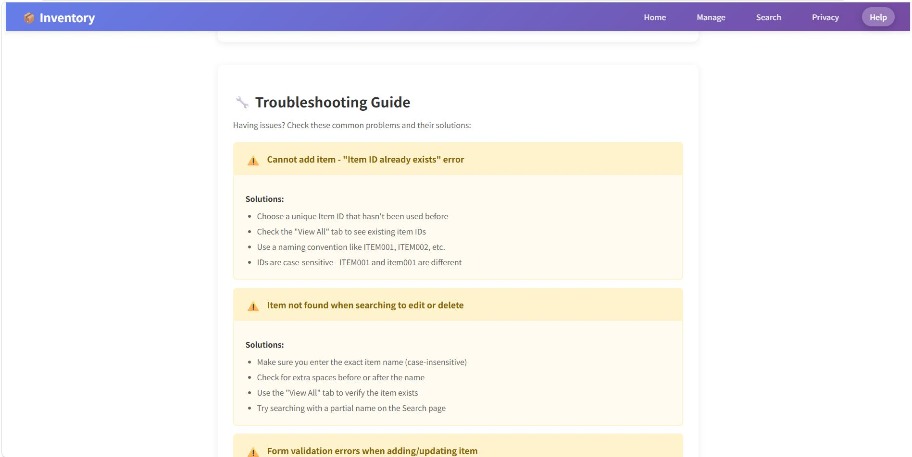

# 仓库管理系统

---

## 项目名称

智能仓库管理系统 (Intelligent Warehouse Management System)

---

## 项目简介

本项目是一款面向中小型企业的仓库管理解决方案，提供入库、出库、库存查询、数据导入导出、库存预警、审计日志等核心功能。系统采用现代化的前后端分离架构，支持本地数据持久化，确保数据安全可靠。

---

## 开发技术栈

| 类别 | 技术 | 说明 |
|------|------|------|
| 前端框架 | Angular 21+ | 现代化响应式前端框架 |
| 编程语言 | TypeScript 5.x | 类型安全的 JavaScript 超集 |
| 样式设计 | CSS3 | 响应式布局与动画效果 |
| 数据存储 | LocalStorage | 浏览器本地数据持久化 |
| 构建工具 | Angular CLI / Vite | 项目构建与热更新 |
| 版本控制 | Git | 代码版本管理 |

---

## 系统核心功能

### 1. 库存管理

- 商品信息的增删改查（CRUD）操作
- 支持商品名称、分类、数量、单价、供应商等完整字段
- 商品人気标记功能
- 商品备注信息管理

### 2. 数据导入导出

- 支持 JSON 格式批量导入导出
- 支持 CSV 格式数据交换
- 导入数据实时校验与错误提示
- 导出数据包含完整商品信息及统计摘要

### 3. 库存预警系统

- 低库存预警（数量低于阈值时自动提醒）
- 缺货提醒（库存为零时醒目提示）
- 首页仪表盘实时展示预警信息
- 支持自定义低库存阈值

### 4. 审计日志

- 记录所有库存操作（添加/修改/删除）
- 记录数据导入导出操作
- 操作时间、操作类型、操作详情完整追溯
- 首页展示最近活动记录

### 5. 高级搜索与筛选

- 按商品名称关键词搜索
- 按分类筛选
- 按库存状态筛选（充足/低库存/缺货）
- 按价格范围、数量范围、供应商等多维度筛选
- 支持按名称、数量、价格、分类排序
- 实时显示筛选结果统计

### 6. 批量操作

- 支持多选商品进行批量删除
- 全选/取消全选功能
- 批量操作确认与结果反馈

---

## 系统架构

```
┌─────────────────────────────────────────────────────────────┐
│                        前端展示层                            │
│  ┌─────────┐  ┌─────────────┐  ┌──────────┐  ┌───────────┐ │
│  │ 首页    │  │ 库存管理    │  │ 搜索页面  │  │ 数据统计  │ │
│  │ Home    │  │ Item Manage │  │ Search   │  │ Statistics│ │
│  └────┬────┘  └──────┬──────┘  └────┬─────┘  └─────┬─────┘ │
└───────┼──────────────┼─────────────┼───────────────┼───────┘
        │              │             │               │
┌───────┴──────────────┴─────────────┴───────────────┴───────┐
│                       业务逻辑层                            │
│  ┌─────────────────────────────────────────────────────┐   │
│  │              InventoryService (库存服务)              │   │
│  │  • 数据持久化    • 审计日志      • 导入导出           │   │
│  │  • 库存预警      • 搜索过滤      • 统计分析           │   │
│  └─────────────────────────────────────────────────────┘   │
└───────────────────────────┬─────────────────────────────────┘
                            │
┌───────────────────────────┴─────────────────────────────────┐
│                         数据存储层                            │
│  ┌─────────────────────────────────────────────────────┐    │
│  │              LocalStorage (本地存储)                  │    │
│  │  • items: 商品数据                                   │    │
│  │  • auditLog: 审计日志                                │    │
│  │  • settings: 系统设置                                │    │
│  └─────────────────────────────────────────────────────┘    │
└─────────────────────────────────────────────────────────────┘
```

---

## 运行环境与部署教程

### 环境要求

| 环境 | 版本要求 |
|------|----------|
| Node.js | 18.x 或更高版本 |
| npm | 9.x 或更高版本 |
| 浏览器 | Chrome 100+ / Firefox 100+ / Safari 15+ / Edge 100+ |

### 本地开发部署

```bash
# 1. 克隆项目
git clone <repository-url>
cd Inventory-Management-System-main/PART2

# 2. 安装依赖
npm install

# 3. 启动开发服务器
npm start
# 或指定端口
npx ng serve --port 4200

# 4. 访问应用
# 打开浏览器访问 http://localhost:4200
```

### 生产环境构建

```bash
# 1. 安装依赖（如未安装）
npm install

# 2. 执行生产构建
npm run build

# 3. 构建产物位于 dist/ 目录
# 4. 可通过任意静态服务器部署
npx serve dist
```

### 部署到 Web 服务器

构建产物 `dist/PART2/` 目录包含静态资源，可直接部署到：

- Apache HTTP Server
- Nginx
- IIS
- GitHub Pages
- Vercel
- Netlify

```nginx
# Nginx 配置示例
server {
    listen 80;
    server_name your-domain.com;
    root /path/to/dist/PART2;
    index index.html;
    try_files $uri $uri/ /index.html;
}
```

---

## 项目亮点

### 1. 纯前端架构

本系统采用纯前端实现，无需后端服务器即可独立运行。通过 LocalStorage 实现数据持久化，既保证了数据隐私性，又降低了部署复杂度。

### 2. 完善的审计机制

所有库存操作都被完整记录，包括操作时间、类型、详情及变更前后数值，便于追溯和责任认定。

### 3. 智能库存预警

系统自动计算库存状态（充足/低库存/缺货），并在首页醒目位置展示预警信息，帮助用户及时发现问题。

### 4. 灵活的导入导出

支持 JSON 和 CSV 两种常用数据格式，满足不同业务场景需求。导入时进行数据校验，确保数据完整性。

### 5. 现代化用户体验

采用卡片式布局、流畅动画过渡、清晰的状态反馈，提供媲美原生应用的使用体验。

---

## 开发声明

**开发声明**

本项目由 **王昱宁（Yuning Wang）** 独立完成，从需求分析、架构设计、编码实现到测试部署，全程单人开发。

**原创性声明**

- 所有代码由开发者亲自编写，无 AI 代码生成
- 全部设计思路源自开发者独立思考
- 未使用任何第三方 AI 代码辅助工具
- 符合学术诚信与职业操守

**Copyright © 2024-2026 王昱宁 (Yuning Wang). All Rights Reserved.**

---

## 项目截图展示

### 1. 首页仪表盘

首页展示库存统计概览、低库存预警提醒、最新活动记录。包含总商品数、总价值、低库存商品数等关键指标卡片。



### 2. 库存管理列表

库存管理主页面，展示所有商品的完整列表信息，包括名称、分类、数量、价格、供应商等关键信息。



### 3. 添加商品表单

添加新商品的表单页面，填写商品名称、分类、数量、单价、供应商等信息。



### 4. 编辑商品信息

编辑现有商品信息的页面，可修改商品的各项属性。



### 5. 删除确认

删除商品时的确认界面，确保操作安全。



### 6. 数据导入

支持 JSON 和 CSV 格式的批量数据导入功能，提供数据校验和导入结果反馈。



### 7. 数据导出

导出数据功能，支持 JSON 和 CSV 格式，可导出完整商品列表。



### 8. 审计日志

完整记录所有库存操作（添加/修改/删除/导入/导出），支持按操作类型筛选，便于操作追溯。



### 9. 搜索与筛选

高级搜索功能，支持按名称、分类、库存状态、价格范围、数量范围等多维度筛选和排序。



### 10. 批量操作

批量选择和删除商品功能，提高管理效率。



---

## 联系方式

**开发者**

- 姓名：王昱宁 (Yuning Wang)
- 邮箱：13043716833@163.com

---

**最后更新日期**：2026-06-18

---

# Inventory Management System

---

## Project Name

Intelligent Warehouse Management System

---

## Project Introduction

This project is a warehouse management solution for small and medium-sized enterprises, providing core functions such as warehousing, outbound, inventory query, data import/export, inventory warning, and audit logs. The system adopts a modern front-end and back-end separated architecture, supporting local data persistence to ensure data security and reliability.

---

## Technology Stack

| Category | Technology | Description |
|----------|------------|-------------|
| Frontend Framework | Angular 21+ | Modern responsive frontend framework |
| Programming Language | TypeScript 5.x | Type-safe JavaScript superset |
| Styling | CSS3 | Responsive layout and animations |
| Data Storage | LocalStorage | Browser local data persistence |
| Build Tool | Angular CLI / Vite | Project build and hot reload |
| Version Control | Git | Code version management |

---

## Core Features

### 1. Inventory Management

- CRUD operations for product information (Create, Read, Update, Delete)
- Complete fields including product name, category, quantity, unit price, supplier, etc.
- Product popularity marking feature
- Product comment/note management

### 2. Data Import/Export

- Batch import/export in JSON format
- CSV format data exchange support
- Real-time data validation and error prompts during import
- Export includes complete product information and statistical summary

### 3. Inventory Alert System

- Low stock warning (automatic alert when quantity falls below threshold)
- Out-of-stock notification (prominent alert when inventory is zero)
- Real-time alert display on homepage dashboard
- Customizable low stock threshold

### 4. Audit Log

- Records all inventory operations (Add/Update/Delete)
- Records data import/export operations
- Complete traceability with operation time, type, and details
- Recent activity display on homepage

### 5. Advanced Search & Filtering

- Keyword search by product name
- Filter by category
- Filter by stock status (In Stock/Low Stock/Out of Stock)
- Multi-dimensional filtering by price range, quantity range, supplier, etc.
- Sorting by name, quantity, price, category
- Real-time display of filtered results statistics

### 6. Batch Operations

- Multi-select products for batch deletion
- Select all/deselect all functionality
- Batch operation confirmation and result feedback

---

## System Architecture

```
┌─────────────────────────────────────────────────────────────┐
│                      Frontend Display Layer                  │
│  ┌─────────┐  ┌─────────────┐  ┌──────────┐  ┌───────────┐ │
│  │  Home   │  │Item Manage  │  │  Search  │  │Statistics │ │
│  └────┬────┘  └──────┬──────┘  └────┬─────┘  └─────┬─────┘ │
└───────┼──────────────┼─────────────┼───────────────┼───────┘
        │              │             │               │
┌───────┴──────────────┴─────────────┴───────────────┴───────┐
│                      Business Logic Layer                   │
│  ┌─────────────────────────────────────────────────────┐   │
│  │            InventoryService (Inventory Service)        │   │
│  │  • Data Persistence  • Audit Log    • Import/Export   │   │
│  │  • Stock Alert       • Search/Filter• Statistics      │   │
│  └─────────────────────────────────────────────────────┘   │
└───────────────────────────┬─────────────────────────────────┘
                            │
┌───────────────────────────┴─────────────────────────────────┐
│                       Data Storage Layer                      │
│  ┌─────────────────────────────────────────────────────┐    │
│  │               LocalStorage (Local Storage)             │    │
│  │  • items: Product data                               │    │
│  │  • auditLog: Audit log                               │    │
│  │  • settings: System settings                         │    │
│  └─────────────────────────────────────────────────────┘    │
└─────────────────────────────────────────────────────────────┘
```

---

## Environment & Deployment

### Environment Requirements

| Environment | Version Requirement |
|-------------|---------------------|
| Node.js | 18.x or higher |
| npm | 9.x or higher |
| Browser | Chrome 100+ / Firefox 100+ / Safari 15+ / Edge 100+ |

### Local Development Deployment

```bash
# 1. Clone the project
git clone <repository-url>
cd Inventory-Management-System-main/PART2

# 2. Install dependencies
npm install

# 3. Start development server
npm start
# Or specify port
npx ng serve --port 4200

# 4. Access the application
# Open browser to http://localhost:4200
```

### Production Build

```bash
# 1. Install dependencies (if not already installed)
npm install

# 2. Run production build
npm run build

# 3. Build output is in dist/ directory
# 4. Can be deployed with any static server
npx serve dist
```

### Deploy to Web Server

The build output in `dist/PART2/` contains static resources and can be directly deployed to:

- Apache HTTP Server
- Nginx
- IIS
- GitHub Pages
- Vercel
- Netlify

```nginx
# Nginx configuration example
server {
    listen 80;
    server_name your-domain.com;
    root /path/to/dist/PART2;
    index index.html;
    try_files $uri $uri/ /index.html;
}
```

---

## Project Highlights

### 1. Pure Frontend Architecture

The system adopts a pure frontend implementation, running independently without a backend server. Data persistence through LocalStorage ensures data privacy while reducing deployment complexity.

### 2. Complete Audit Mechanism

All inventory operations are completely recorded, including operation time, type, details, and values before and after changes, facilitating traceability and accountability.

### 3. Intelligent Inventory Alert

The system automatically calculates inventory status (In Stock/Low Stock/Out of Stock) and displays alert information prominently on the homepage, helping users promptly identify issues.

### 4. Flexible Import/Export

Supports both JSON and CSV data formats to meet different business scenario requirements. Data validation during import ensures data integrity.

### 5. Modern User Experience

Adopts card-based layout, smooth animation transitions, and clear status feedback, providing a native-like user experience.

---

## Development Statement

**Development Statement**

This project was independently completed by **Wang Yuning (Yuning Wang)**, from requirement analysis, architecture design, coding implementation to testing and deployment, the entire process was developed by a single person.

**Originality Statement**

- All code was personally written by the developer, no AI code generation
- All design ideas came from the developer's independent thinking
- No third-party AI code assistance tools were used
- Complies with academic integrity and professional ethics

**Copyright © 2024-2026 Wang Yuning (Yuning Wang). All Rights Reserved.**

---

## Project Screenshots

### 1. Home Dashboard

Homepage displays inventory statistics overview, low stock alerts, and recent activity records. Includes key metric cards such as total products, total value, and low stock items.


### 2. Inventory List

Main inventory management page displaying all products with detailed information including name, category, quantity, price, supplier, etc.


### 3. Add Item Form

Form page for adding new products, filling in product name, category, quantity, unit price, supplier and other information.


### 4. Edit Item

Page for editing existing product information, allowing modification of various product attributes.


### 5. Delete Confirmation

Confirmation interface when deleting products to ensure safe operations.


### 6. Data Import

Batch data import feature supporting JSON and CSV formats, providing data validation and import result feedback.


### 7. Data Export

Data export feature supporting JSON and CSV formats, allowing export of complete product lists.


### 8. Audit Log

Completely records all inventory operations (Add/Update/Delete/Import/Export), supports filtering by operation type for easy traceability.


### 9. Search & Filter

Advanced search feature supporting multi-dimensional filtering and sorting by name, category, stock status, price range, quantity range, etc.


### 10. Batch Operations

Batch selection and deletion of products to improve management efficiency.


---

## Contact Information

**Developer**

- Name:Yuning Wang
- Email: 13043716833@163.com

---

**Last Updated**: 2026-06-18
